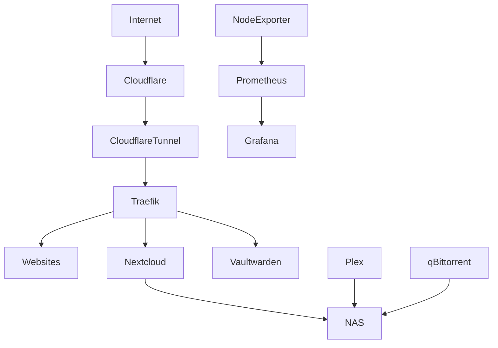
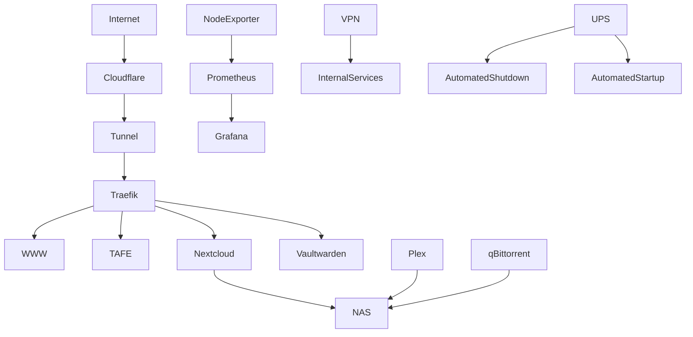

# Homelab Infrastructure Platform

## Overview

This repository contains the design, deployment, operation, and documentation of a self-hosted Homelab environment built to develop practical experience in systems administration, networking, security, monitoring, backup and recovery, and infrastructure operations.

The platform is designed using a phased implementation approach and incorporates technologies and operational practices commonly found in modern enterprise environments.

The primary goal of this project is to gain hands-on experience building, operating, documenting, monitoring, securing, and recovering infrastructure while demonstrating industry-relevant skills.

---

# Objectives

This Homelab has been built to develop practical experience in:

* Linux Administration
* Docker & Containerisation
* Infrastructure Operations
* Reverse Proxy Technologies
* Cloud Networking
* Monitoring & Observability
* Identity & Access Management
* Backup & Disaster Recovery
* Security Operations
* Technical Documentation

---

# Skills Demonstrated

## Infrastructure

* Ubuntu Server
* Docker Engine
* Docker Compose
* Linux Systems Administration
* Service Management

## Networking

* Reverse Proxy Design
* Cloudflare Tunnel
* DNS Management
* Service Routing
* Container Networking

## Monitoring

* Grafana
* Prometheus
* Node Exporter
* Metrics Collection
* Performance Analysis

## Security

* Vaultwarden
* VPN Services
* Access Control
* Credential Management
* Service Exposure Management

## Operations

* Backup Strategy Design
* Disaster Recovery Planning
* Change Management
* Technical Documentation
* Incident Troubleshooting

---

# Architecture Overview



---

# Current Platform Status

The table below reflects the current deployment status of services within the Homelab environment.

| Stack          | Service            | Status        |
| -------------- | ------------------ | ------------- |
| Proxy          | Traefik            | ✅ Operational |
| Proxy          | Cloudflare Tunnel  | ✅ Operational |
| HTTP           | Nginx (www)        | ✅ Operational |
| HTTP           | Nginx (tafe)       | ✅ Operational |
| Monitoring     | Grafana            | 🚧 Planned    |
| Monitoring     | Prometheus         | 🚧 Planned    |
| Monitoring     | Node Exporter      | 🚧 Planned    |
| Security       | Vaultwarden        | ✅ Operational |
| Security       | VPN                | 🚧 Planned    |
| Storage        | Nextcloud          | ✅ Operational |
| Media          | Plex               | 🚧 Planned    |
| Media          | qBittorrent        | 🚧 Planned    |
| Infrastructure | UPS Integration    | 🚧 Planned    |
| Infrastructure | Automated Recovery | 🚧 Planned    |

---

# Homelab Progress

The platform is being developed using a phased implementation model.

| Phase   | Description          | Status         |
| ------- | -------------------- | -------------- |
| Phase 0 | Platform Preparation | ✅ Complete     |
| Phase 1 | Foundation           | ✅ Complete     |
| Phase 2 | Observability        | 🚧 In Progress |
| Phase 3 | Security             | 🚧 In Progress |
| Phase 4 | Productivity         | 🚧 In Progress |
| Phase 5 | Expansion            | ⏳ Planned      |
| Phase 6 | NAS & Media          | ⏳ Planned      |

---

# Target State Architecture



---

# Roadmap

## Short Term

* Deploy Node Exporter
* Deploy Prometheus
* Deploy Grafana
* Build monitoring dashboards
* Deploy VPN services
* Complete monitoring documentation

### Target Outcome

Establish full infrastructure visibility and secure administrative access.

---

## Medium Term

* Implement UPS integration
* Automate graceful shutdown procedures
* Automate startup recovery procedures
* Implement backup validation testing
* Expand disaster recovery runbooks

### Target Outcome

Improve resilience and reduce operational risk during outages and recovery events.

---

## Long Term

* Deploy NAS infrastructure
* Deploy Plex
* Deploy qBittorrent
* Implement centralised logging
* Introduce security monitoring
* Implement network segmentation
* Expand automation and operational tooling

### Target Outcome

Transition the environment into a mature, fully documented, monitored, and recoverable infrastructure platform.

---

# Planned End State

Upon completion, the platform will provide:

* Secure Remote Access
* Reverse Proxy Services
* Website Hosting
* Infrastructure Monitoring
* Password Management
* Private Cloud Storage
* Media Streaming
* Automated Backup Operations
* Disaster Recovery Procedures
* UPS-Based Power Protection
* Comprehensive Infrastructure Documentation

The project is intentionally built using a phased approach to demonstrate not only technical implementation skills, but also planning, documentation, operational management, security, monitoring, and recovery practices commonly found in enterprise environments.

---

# Documentation

## Architecture

Location:

```text
docs/architecture/
```

Documents:

* DESIGN.md
* NETWORK_OVERVIEW.md
* SECURITY_MODEL.md
* BACKUP_STRATEGY.md

---

## Build Plans

Location:

```text
docs/build-plan/
```

Documents:

* PHASE_0_PLATFORM_PREPARATION.md
* PHASE_1_FOUNDATION.md
* PHASE_2_OBSERVABILITY.md
* PHASE_3_SECURITY.md
* PHASE_4_PRODUCTIVITY.md
* PHASE_5_EXPANSION.md
* PHASE_6_NAS_MEDIA.md

---

## Network Diagrams

Location:

```text
docs/network-diagrams/
```

Contains:

* Phase Diagrams
* Service Flow Diagrams
* Final Architecture Diagrams

---

## Runbooks

Location:

```text
docs/runbooks/
```

Documents:

* BACKUP_RESTORE.md
* DISASTER_RECOVERY.md
* PLATFORM_REBUILD.md
* POWER_OUTAGE_PROCEDURE.md
* UPS_OPERATIONS.md
* CHANGE_MANAGEMENT.md

---

## Standards

Location:

```text
docs/standards/
```

Documents:

* DOCUMENTATION_STANDARD.md
* SERVICE_DOCUMENTATION_STANDARD.md
* TROUBLESHOOTING_STANDARD.md
* SECURITY_DISCLOSURE_POLICY.md

---

# Repository Structure

```text
homelab/
│
├── docs/
│   ├── architecture/
│   ├── build-plan/
│   ├── network-diagrams/
│   ├── runbooks/
│   └── standards/
│
├── stacks/
│   ├── proxy/
│   ├── http/
│   ├── monitoring/
│   ├── security/
│   ├── storage/
│   └── media/
│
├── data/
├── logs/
├── scripts/
├── backups/
├── secrets/
└── shared/
```

---

# Key Features

* Reverse Proxy Architecture
* Zero Trust Ingress Design
* Infrastructure Monitoring
* Password Management
* Private Cloud Storage
* Automated Backups
* Disaster Recovery Planning
* UPS Shutdown Automation
* Infrastructure Documentation
* Multi-Phase Build Strategy

---

# Backup and Recovery

The platform follows a three-tier backup strategy.

## Daily Backup (Son)

Protects frequently changing application and configuration data.

Examples:

* Website content
* Service configurations
* Application data
* Databases

Retention:

* 7 Days

---

## Weekly Backup (Father)

Provides recoverable platform snapshots.

Examples:

* Docker volumes
* Service data
* Application exports

Retention:

* 4 Weeks

---

## Monthly Backup (Grandfather)

Provides long-term disaster recovery capability.

Examples:

* Infrastructure archives
* Critical service data
* Historical backups

Storage:

* Off-site storage

---

Supporting documentation:

```text
docs/architecture/BACKUP_STRATEGY.md
docs/runbooks/BACKUP_RESTORE.md
docs/runbooks/DISASTER_RECOVERY.md
```

---

# Technology Stack

## Operating System

* Ubuntu Server

## Container Platform

* Docker
* Docker Compose

## Networking

* Traefik
* Cloudflare Tunnel

## Monitoring

* Grafana
* Prometheus
* Node Exporter

## Security

* Vaultwarden
* VPN

## Storage

* Nextcloud
* NAS (Planned)

## Media

* Plex (Planned)
* qBittorrent (Planned)

---

# Operational Focus Areas

The environment places strong emphasis on:

* Documentation
* Security
* Recoverability
* Monitoring
* Backup Validation
* Disaster Recovery
* Change Management
* Automation
* Infrastructure Operations

---

# Future Enhancements

Planned future improvements include:

* Centralised Logging
* CrowdSec
* Wazuh
* Uptime Monitoring
* Security Monitoring
* Configuration Management
* Infrastructure Automation
* Network Segmentation
* NAS Expansion
* Backup Validation Automation
* Recovery Testing Automation

---

# Learning Outcomes

This Homelab is designed as a practical learning platform focused on building real-world infrastructure skills.

The objective is not simply to deploy services, but to operate them using documentation, procedures, monitoring, security controls, backup strategies, and recovery processes that mirror practices commonly used in professional IT environments.

Through this project I am developing hands-on experience in:

* Linux Administration
* Systems Administration
* Networking
* Docker
* Monitoring
* Security
* Infrastructure Operations
* Technical Documentation
* Backup & Recovery
* Platform Lifecycle Management

---

# Guiding Principle

Infrastructure should be:

* Secure
* Documented
* Observable
* Recoverable
* Maintainable

Technology changes. Operational discipline scales.
